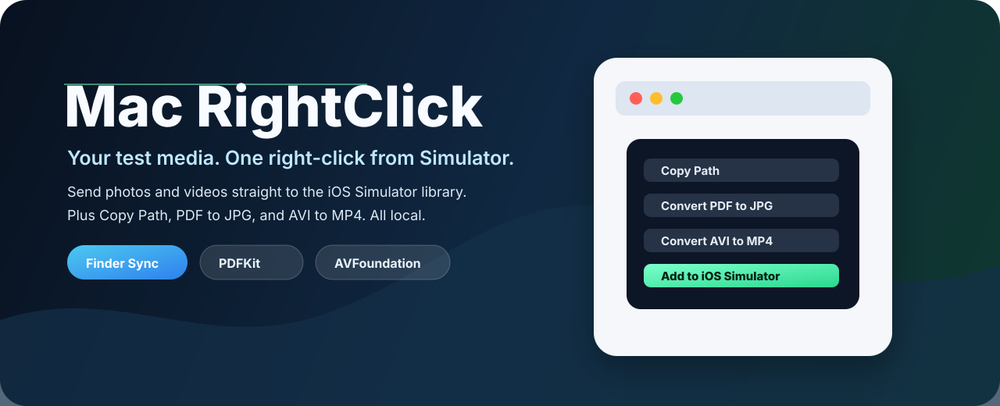

<p align="center">
  
</p>

<p align="center">
  <strong>English</strong> ·
  <a href="./README.zh-CN.md">简体中文</a>
</p>

<p align="center">
  <a href="#features">Features</a> ·
  <a href="#install">Install</a> ·
  <a href="#release-dmg">Release DMG</a> ·
  <a href="#privacy">Privacy</a>
</p>

<p align="center">
  
  
  
  
</p>

**Mac RightClick** is a tiny native macOS utility that adds focused actions to Finder's right-click menu. It keeps everyday file operations where they belong: directly beside the file, with no Shortcuts, no Automator workflow, and no cloud service in the middle.

## Why Copy Path?

Finder already lets you hold **Option** in its contextual menu to reveal **Copy as Pathname**. That works, but I do not want to press Option either. This operation is so simple it deserves a one-handed flow from start to finish: select the file, right-click it, choose **Copy Path**.

<p align="center">
  
</p>

<p align="center">
  
</p>

## Features

| Action | Appears when | Output |
| --- | --- | --- |
| **Copy Path** | Any Finder item is selected | Copies absolute file paths to the clipboard, one per line |
| **Convert PDF to JPG** | Every selected item is a PDF | Single-page PDFs create `Name.jpg`; multi-page PDFs create a `Name JPG` folder |
| **Convert AVI to MP4** | Every selected item is an `.avi` file | Creates `Name.mp4` beside the source AVI |

### Built on Apple frameworks

- **Finder Sync** adds the root contextual menu items in Finder.
- **PDFKit** renders PDF pages to JPG at 200 DPI with high-quality JPEG output.
- **AVFoundation** exports AVI video to MP4 locally.
- **AppKit pasteboard** powers `Copy Path` without extra dependencies.

## Install

Download the release DMG, open it, and drag **MacRightClick.app** into **Applications**.

Then enable the Finder extension:

1. Open **System Settings**.
2. Go to **General > Login Items & Extensions**.
3. Open **Extensions / Finder Extensions**.
4. Enable **Mac RightClick**.
5. Relaunch Finder, or run:

```bash
killall Finder
```

## Use

Right-click selected files in Finder:

```text
Copy Path
Convert PDF to JPG
Convert AVI to MP4
```

Conversion output is written next to the source file. Existing files are not overwritten; Mac RightClick adds a numeric suffix when needed.

<p align="center">
  
</p>

## Release DMG

A release DMG can be created from the Xcode project with Apple's built-in tools:

```bash
xcodebuild -project MacRightClick.xcodeproj \
  -scheme MacRightClick \
  -configuration Release \
  -derivedDataPath /private/tmp/MacRightClickReleaseDerived \
  build

hdiutil create \
  -volname "Mac RightClick" \
  -srcfolder /private/tmp/MacRightClickDMGRoot \
  -ov \
  -format UDZO \
  dist/MacRightClick.dmg
```

The current packaged artifact is expected at:

```text
dist/MacRightClick.dmg
```

## Privacy

Mac RightClick is intentionally boring about data:

- It processes files locally on your Mac.
- It does not upload files.
- It does not request notification permission.
- It only acts on files the user selected in Finder.
- macOS may ask for file access the first time output is written into protected folders such as Downloads, Desktop, Documents, or Movies.

## Development

Generate the Xcode project if needed:

```bash
xcodegen generate
```

Build locally:

```bash
xcodebuild -project MacRightClick.xcodeproj \
  -scheme MacRightClick \
  -configuration Debug \
  -derivedDataPath /private/tmp/MacRightClickDebugDerived \
  build
```

Useful verification commands:

```bash
codesign --verify --deep --strict --verbose=2 /Applications/MacRightClick.app
pluginkit -m -A -D -vvv -p com.apple.FinderSync | grep MacRightClick
```

## Notes

Finder Sync extensions are managed by macOS. If a newly installed build does not appear immediately, relaunch Finder and confirm the extension is enabled in System Settings.
