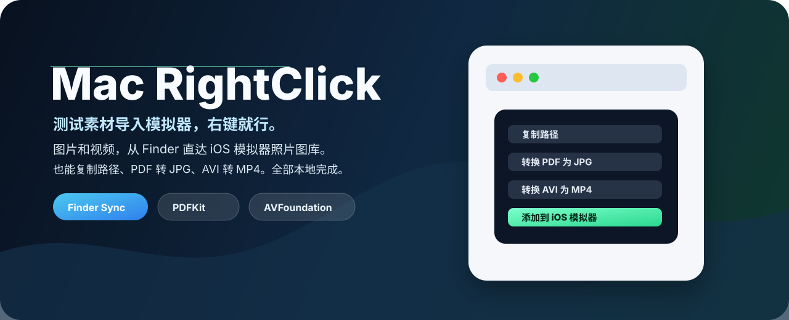
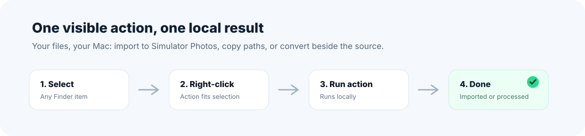

<p align="center">
  
</p>

<p align="center">
  <a href="./README.md">English</a> ·
  <strong>简体中文</strong>
</p>

<p align="center">
  <a href="#功能">功能</a> ·
  <a href="#安装">安装</a> ·
  <a href="#release-dmg">Release DMG</a> ·
  <a href="#隐私">隐私</a>
</p>

<p align="center">
  
  
  
  
</p>

**Mac RightClick** 是一个轻量的原生 macOS 工具，为 Finder 的右键菜单加入专注、直接的文件操作。日常文件操作就应该在文件旁边完成，不需要快捷指令、不需要 Automator，也不需要把文件交给云服务。

## 为什么有 Copy Path？

我知道 Finder 的右键菜单里按住 **Option** 会把 **拷贝** 变成 **拷贝为路径名**。它当然能用，但我连 Option 都不想按。这件事简单到应该一只手就能做完：选中文件、右键、点击 **Copy Path**。

<p align="center">
  
</p>

<p align="center">
  
</p>

## 功能

| 操作 | 显示条件 | 输出 |
| --- | --- | --- |
| **Copy Path** | 选中了任意 Finder 项目 | 将绝对路径复制到剪贴板，每行一个 |
| **Convert PDF to JPG** | 所有选中项都是 PDF | 单页 PDF 输出为 `Name.jpg`；多页 PDF 输出到 `Name JPG` 文件夹 |
| **Convert AVI to MP4** | 所有选中项都是 `.avi` 文件 | 在源 AVI 文件旁生成 `Name.mp4` |

### 使用 Apple 原生框架

- **Finder Sync** 在 Finder 的根级右键菜单中加入操作。
- **PDFKit** 以 200 DPI 高质量 JPEG 输出渲染 PDF 页面。
- **AVFoundation** 在本地将 AVI 视频导出为 MP4。
- **AppKit pasteboard** 为 **Copy Path** 提供无依赖的剪贴板支持。

## 安装

下载 Release DMG，打开后将 **MacRightClick.app** 拖入 **Applications**。

然后启用 Finder 扩展：

1. 打开 **系统设置**。
2. 前往 **通用 > 登录项与扩展**。
3. 打开 **扩展 / Finder 扩展**。
4. 启用 **Mac RightClick**。
5. 重新启动 Finder，或运行：

```bash
killall Finder
```

## 使用

在 Finder 中选中文件后右键：

```text
Copy Path
Convert PDF to JPG
Convert AVI to MP4
```

转换结果会写入源文件旁。已有文件不会被覆盖；需要时 Mac RightClick 会自动附加数字后缀。

<p align="center">
  
</p>

## Release DMG

可以使用 Xcode 项目和 Apple 自带工具创建发布 DMG：

```bash
xcodebuild -project MacRightClick.xcodeproj \
  -scheme MacRightClick \
  -configuration Release \
  -derivedDataPath /private/tmp/MacRightClickReleaseDerived \
  build

hdiutil create \
  -volname "Mac RightClick" \
  -srcfolder /private/tmp/MacRightClickDMGRoot \
  -ov \
  -format UDZO \
  dist/MacRightClick.dmg
```

当前打包产物位于：

```text
dist/MacRightClick.dmg
```

## 隐私

Mac RightClick 对数据的态度很简单：

- 所有文件均在本机处理。
- 不会上传文件。
- 不会请求通知权限。
- 只会处理用户在 Finder 中选中的文件。
- 第一次向“下载”“桌面”“文稿”或“影片”等受保护目录写入文件时，macOS 可能请求文件访问权限。

## 开发

需要时生成 Xcode 项目：

```bash
xcodegen generate
```

本地构建：

```bash
xcodebuild -project MacRightClick.xcodeproj \
  -scheme MacRightClick \
  -configuration Debug \
  -derivedDataPath /private/tmp/MacRightClickDebugDerived \
  build
```

常用验证命令：

```bash
codesign --verify --deep --strict --verbose=2 /Applications/MacRightClick.app
pluginkit -m -A -D -vvv -p com.apple.FinderSync | grep MacRightClick
```

## 说明

Finder Sync 扩展由 macOS 管理。新安装的版本没有立即出现时，请重新启动 Finder，并确认扩展已在系统设置中启用。
